# MBTI Test Application - Architecture Diagram

```mermaid
graph TD
    subgraph "Entry Point"
        MAIN[main.py<br/>Application entry & flow control]
        APP[MBTIApp class<br/>Main application orchestrator]
    end
    
    subgraph "Core Engine"
        ENGINE[test_engine.py<br/>Test flow & question management]
        SCORER[scoring.py<br/>MBTI calculation & analysis]
        VALIDATOR[validator.py<br/>Response validation & integrity]
        SESSION[session.py<br/>Save/resume & persistence]
    end
    
    subgraph "User Interface"
        COMPONENTS[components.py<br/>Reusable UI elements]
        THEMES[themes.py<br/>Color schemes & styling]
        ANIMATIONS[animations.py<br/>Loading & transitions]
    end
    
    subgraph "Display & Reporting"
        CHARTS[charts.py<br/>Terminal visualizations]
        REPORTS[reports.py<br/>Results formatting]
    end
    
    subgraph "Utilities"
        EXPORTER[exporter.py<br/>Export to JSON/TXT]
        HELPERS[helpers.py<br/>Common utilities]
    end
    
    subgraph "Configuration"
        SETTINGS[settings.py<br/>App configuration & constants]
    end
    
    subgraph "Data Layer"
        QUESTIONS[(questions.json<br/>88 test questions)]
        TYPES[(personality_types.json<br/>16 type descriptions)]
        FUNCTIONS[(cognitive_functions.json<br/>Function mappings)]
    end
    
    subgraph "File System"
        SESSIONS[(Session Files<br/>~/.mbti_test/)]
        EXPORTS[(Export Files<br/>~/Documents/MBTI_Results/)]
    end
    
    subgraph "External Dependencies"
        RICH[Rich Library<br/>Terminal UI framework]
        QUESTIONARY[Questionary<br/>Interactive prompts]
        PLOTEXT[Plotext<br/>Terminal charts]
        PYFIGLET[PyFiglet<br/>ASCII art text]
    end
    
    %% Main application flow
    MAIN -->|instantiates| APP
    APP -->|initializes| ENGINE
    APP -->|uses| COMPONENTS
    APP -->|displays with| ANIMATIONS
    
    %% Core engine interactions
    ENGINE -->|loads questions| QUESTIONS
    ENGINE -->|calculates with| SCORER
    ENGINE -->|validates using| VALIDATOR
    ENGINE -->|manages state| SESSION
    ENGINE -->|reads config| SETTINGS
    
    %% Scoring interactions
    SCORER -->|analyzes types| TYPES
    SCORER -->|maps functions| FUNCTIONS
    SCORER -->|reads dimensions| SETTINGS
    
    %% Session management
    SESSION -->|writes/reads| SESSIONS
    SESSION -->|reads config| SETTINGS
    
    %% UI flow
    COMPONENTS -->|styles with| THEMES
    COMPONENTS -->|prompts via| QUESTIONARY
    THEMES -->|formatted by| RICH
    ANIMATIONS -->|animated by| RICH
    
    %% Results display
    ENGINE -->|sends results| REPORTS
    REPORTS -->|generates visuals| CHARTS
    CHARTS -->|plots with| PLOTEXT
    REPORTS -->|formats with| RICH
    
    %% Export flow
    REPORTS -->|exports via| EXPORTER
    EXPORTER -->|writes to| EXPORTS
    EXPORTER -->|reads from| SETTINGS
    
    %% Utility usage
    APP -->|utilities from| HELPERS
    ENGINE -->|utilities from| HELPERS
    
    %% ASCII art
    COMPONENTS -->|ASCII art| PYFIGLET
    
    %% Data validation
    VALIDATOR -->|validates against| QUESTIONS
    
    %% Settings usage throughout
    SETTINGS -->|configures| SESSION
    SETTINGS -->|configures| EXPORTER
    SETTINGS -->|configures| ENGINE
    
    style MAIN fill:#FFD93D,stroke:#333,stroke-width:3px
    style ENGINE fill:#00D9FF,stroke:#333,stroke-width:2px
    style SCORER fill:#00D9FF,stroke:#333,stroke-width:2px
    style QUESTIONS fill:#51CF66,stroke:#333,stroke-width:2px
    style TYPES fill:#51CF66,stroke:#333,stroke-width:2px
    style FUNCTIONS fill:#51CF66,stroke:#333,stroke-width:2px
    style SESSIONS fill:#FF6B6B,stroke:#333,stroke-width:2px
    style EXPORTS fill:#FF6B6B,stroke:#333,stroke-width:2px
```

## Component Descriptions

### Core Components

- **main.py**: Entry point that handles command-line arguments and instantiates MBTIApp
- **test_engine.py**: Orchestrates the test flow, manages questions, tracks progress
- **scoring.py**: Contains MBTIScorer and ResultAnalyzer classes for calculating personality type
- **validator.py**: ResponseValidator class for input validation and consistency checks
- **session.py**: SessionManager for save/resume functionality and persistence

### UI Layer

- **components.py**: UIComponents class with methods for displaying questions, progress, menus
- **themes.py**: Color themes, Rich console configuration, Questionary styles
- **animations.py**: Loading spinners, typewriter effects, transition animations

### Display & Reporting

- **charts.py**: Terminal-based visualizations for dimension scores and cognitive stacks
- **reports.py**: Formats and displays comprehensive test results

### Data Flow

1. User starts app via `main.py`
2. `MBTIApp` initializes `TestEngine` with data files
3. `TestEngine` manages question flow and collects responses
4. Responses validated by `ResponseValidator`
5. `SessionManager` auto-saves progress
6. `MBTIScorer` calculates personality type
7. `ResultAnalyzer` enriches with type descriptions
8. `Reports` and `Charts` display results
9. `Exporter` saves results to file system

### Key Interactions

- **Function Calls**: Between Python modules
- **JSON Read**: Loading configuration and data files
- **File I/O**: Session persistence and result exports
- **Library API**: Rich for UI, Questionary for prompts, Plotext for charts