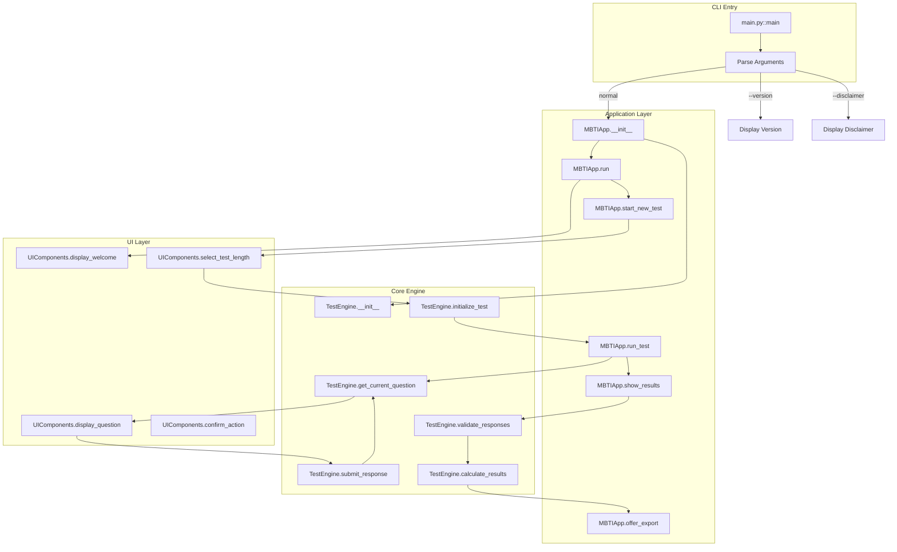
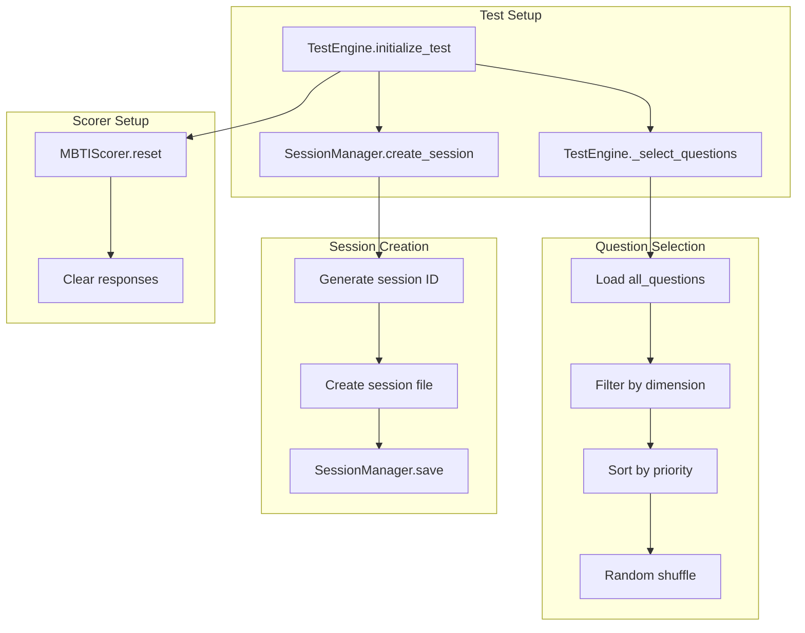
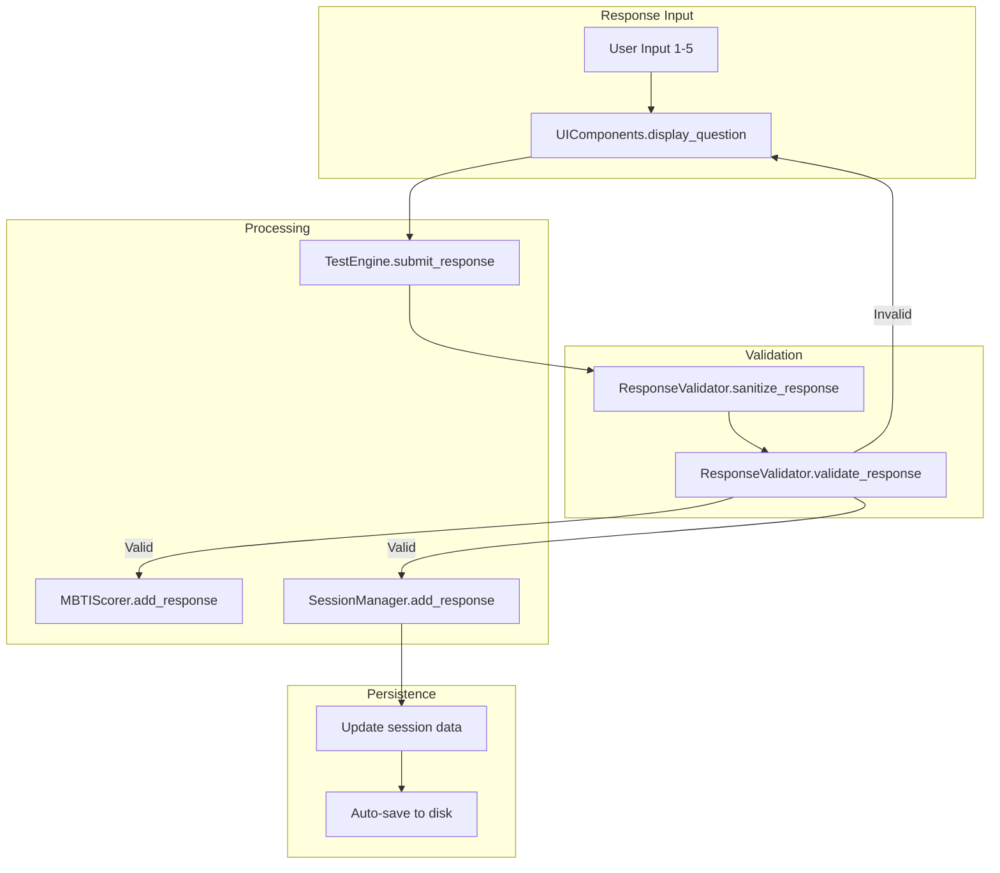
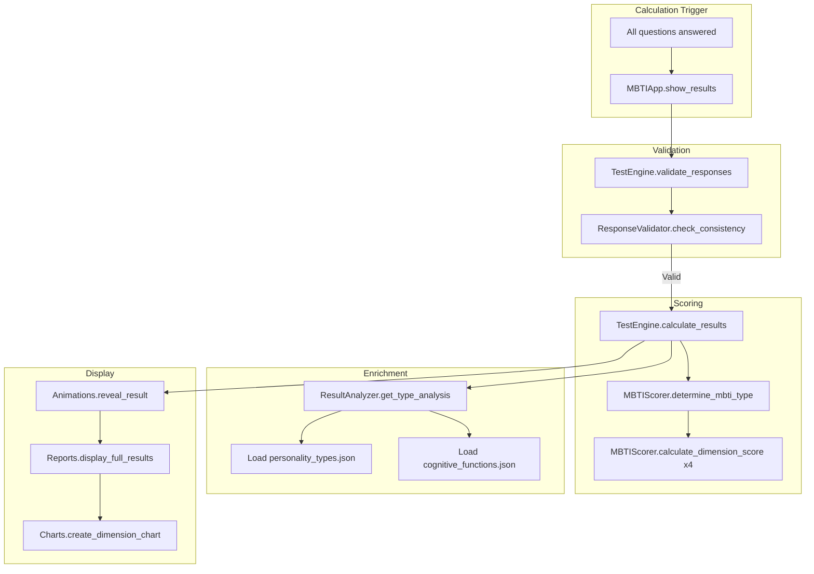
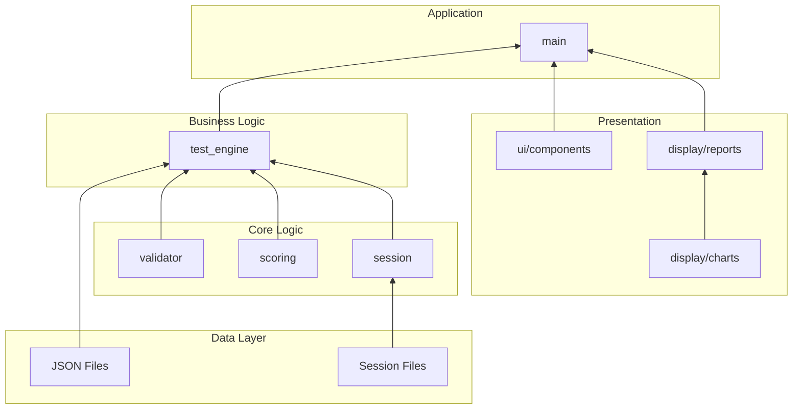

# MBTI Test Application - Call Graph Documentation

## Entry Points and Call Chains

### Main Entry Point



### Test Initialization Flow



### Response Processing Chain



### Results Calculation Flow



## Call Frequency Analysis

### High-Traffic Functions
These functions are called most frequently during a test session:

| Function | Called By | Frequency | Purpose |
|----------|-----------|-----------|---------|
| `SessionManager.save` | All state changes | Every response | Auto-save progress |
| `TestEngine.get_current_question` | Main test loop | Once per question | Question retrieval |
| `ResponseValidator.validate_response` | Submit response | Every input attempt | Input validation |
| `UIComponents.display_question` | Test loop | Once per question | UI rendering |
| `MBTIScorer.add_response` | Submit response | Once per valid response | Score tracking |

### Most Called Utility Functions

| Function | Call Count | Called From |
|----------|------------|-------------|
| `console.print` | ~200+ | All UI components |
| `console.clear` | ~90 | Screen transitions |
| `Path operations` | ~50 | File operations |
| `datetime.now` | ~30 | Timestamps |
| `json.load/dump` | ~20 | Data persistence |

## Cross-Module Dependencies

### Module Interaction Matrix

| Caller → | test_engine | scoring | session | validator | ui | display | utils |
|----------|-------------|---------|---------|-----------|----|---------| ------|
| **main** | ✓ | - | - | - | ✓ | ✓ | ✓ |
| **test_engine** | - | ✓ | ✓ | ✓ | - | - | - |
| **scoring** | - | - | - | - | - | - | - |
| **session** | - | - | - | - | - | - | - |
| **validator** | - | - | - | - | - | - | - |
| **ui** | - | - | - | - | - | - | - |
| **display** | - | - | - | - | - | ✓ | - |

✓ = Direct function calls between modules

### Dependency Layers



## Critical Call Paths

### Test Session Lifecycle
```
python main.py
  └── MBTIApp.run (entry)
      ├── validate_data_files (5ms)
      ├── cleanup_old_sessions (10ms)
      ├── display_welcome (500ms with animation)
      ├── select_test_length (user wait)
      └── initialize_test (20ms)
          ├── _select_questions (5ms)
          ├── create_session (10ms)
          └── run_test (5-25 minutes)
              └── [Question Loop]
                  ├── get_current_question (1ms)
                  ├── display_question (user wait)
                  ├── submit_response (5ms)
                  │   ├── validate_response (1ms)
                  │   ├── add_response (scorer) (1ms)
                  │   └── add_response (session) (10ms save)
                  └── [Repeat 16-88 times]
              └── calculate_results (100ms)
                  ├── validate_responses (10ms)
                  ├── determine_mbti_type (50ms)
                  └── get_type_analysis (20ms)
Total: 5-25 minutes (user-dependent)
```

### Session Resume Path
```
resume_test(session_id)
  └── SessionManager.resume_session (50ms)
      ├── Read session file (10ms)
      ├── Validate timestamp (1ms)
      ├── Restore responses (20ms)
      │   └── [For each response]
      │       └── MBTIScorer.add_response (1ms)
      └── Update current_index (1ms)
Total: ~50ms for typical session
```

### Export Path
```
offer_export(results)
  └── User selects format
      ├── [Text Export]
      │   ├── generate_summary_report (20ms)
      │   ├── Create directory (5ms if needed)
      │   └── Write file (10ms)
      ├── [JSON Export]
      │   ├── json.dumps (5ms)
      │   └── Write file (10ms)
      └── [Clipboard]
          ├── generate_summary_report (20ms)
          └── pyperclip.copy (5ms)
Total: 15-35ms
```

## Dependency Hotspots

### Most Depended Upon Functions
Functions that would have highest impact if changed:

1. **ResponseValidator.validate_response**
   - Called by: TestEngine.submit_response
   - Critical: All user input flows through here
   - Change impact: **High** - Could break input handling

2. **SessionManager.save**
   - Called by: Every state change
   - Critical: Data persistence
   - Change impact: **High** - Could cause data loss

3. **MBTIScorer.calculate_dimension_score**
   - Called by: determine_mbti_type (4 times)
   - Critical: Core algorithm
   - Change impact: **High** - Would affect all results

4. **UIComponents.display_question**
   - Called by: Main test loop
   - Critical: User interaction
   - Change impact: **Medium** - UI changes only

5. **TestEngine.get_current_question**
   - Called by: Main test loop
   - Critical: Question flow
   - Change impact: **Medium** - Could break navigation

### Isolated Components
These have minimal dependencies and are safe to modify:

- **Animations** - Pure presentation, no business logic
- **Charts** - Display only, receives processed data
- **Helpers** - Utility functions, well-isolated
- **Themes** - Visual configuration only

## Performance Characteristics

### Bottlenecks
1. **Session auto-save** (~10ms per response) - File I/O
2. **Terminal clearing** (~5ms) - Screen refresh
3. **Animation delays** (configured delays) - Intentional UX
4. **Question shuffling** (minimal) - O(n) operation

### Optimization Opportunities
- Session saves could be batched (currently immediate)
- Terminal operations could be buffered
- Question selection could be pre-computed
- Results calculation is already optimal (~100ms total)

## Call Graph Summary

The application follows a clear hierarchical structure:

1. **Entry Layer**: `main.py` orchestrates the flow
2. **Business Layer**: `TestEngine` manages test logic
3. **Service Layer**: `Scorer`, `SessionManager`, `Validator` provide services
4. **UI Layer**: `UIComponents`, `Reports`, `Charts` handle presentation
5. **Data Layer**: JSON files provide static data

Key characteristics:
- **No circular dependencies** between modules
- **Clear separation of concerns**
- **Minimal coupling** between layers
- **High cohesion** within modules
- **Predictable call patterns** (no complex recursion)