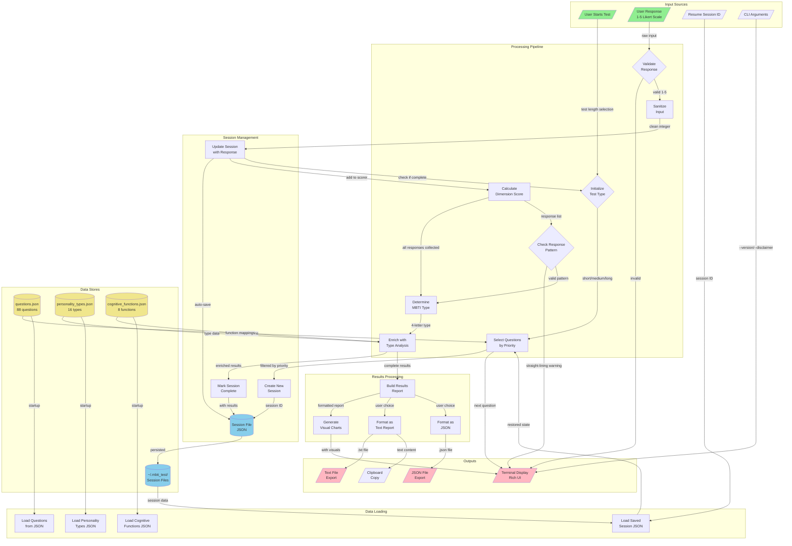

# MBTI Test Application - Data Flow Diagram

## Data Flow Context

### Primary User Flow
1. **Test Initialization** (2-3 seconds)
   - User selects test length → System loads 16/44/88 questions
   - Questions filtered by priority level
   - New session created with timestamp ID

2. **Question-Answer Loop** (5-25 minutes)
   - Each question displayed → User provides 1-5 response
   - Response validated and sanitized
   - Session auto-saved after each answer
   - Progress tracked in memory and on disk

3. **Results Calculation** (<1 second)
   - All responses aggregated by dimension
   - Scoring algorithm calculates percentages
   - MBTI type determined from 4 dimension preferences
   - Results enriched with personality data

4. **Results Display & Export** (2-5 seconds)
   - Terminal display with charts and formatting
   - Optional export to text/JSON
   - Session marked complete

### Data Transformations

#### Input Sanitization
- **Raw Input**: String from terminal (e.g., "3", "3.5", "abc")
- **Sanitized**: Integer 1-5 (clamped if out of range)
- **Location**: `ResponseValidator.sanitize_response()`

#### Score Calculation
- **Input**: List of 1-5 responses per dimension
- **Transformation**: 
  - Reverse-coded questions inverted (5→1, 4→2, etc.)
  - Sum normalized to 0-100 percentage
- **Output**: Preference letter + strength percentage

#### Type Enrichment
- **Input**: 4-letter code (e.g., "INTJ")
- **Enrichment**: Adds title, overview, strengths, careers, etc.
- **Source**: `personality_types.json` lookup

### Data Volume & Performance

| Stage | Data Size | Processing Time |
|-------|-----------|-----------------|
| Question Load | 88 questions (~50KB) | <100ms |
| Session Save | ~2-5KB per save | <50ms |
| Response Validation | Single integer | <1ms |
| Score Calculation | 16-88 responses | <100ms |
| Type Determination | 4 dimension scores | <10ms |
| Results Display | ~10KB formatted | <500ms |
| Export Generation | ~5-15KB file | <2s |

### Data Consistency

#### Transaction Boundaries
- **Session Updates**: Each response is atomic
- **Auto-save**: After every response (no batching)
- **Results**: Calculated only after all questions answered

#### Data Persistence Points
1. Session creation (empty session)
2. After each response (incremental save)
3. On test completion (with results)
4. On manual export (separate file)

#### Recovery Mechanisms
- **Session Resume**: Can recover from any point
- **Incomplete Detection**: Sessions <30min old can resume
- **Data Validation**: Each save includes timestamp

### Error Handling

#### Failed Response Validation
- **Path**: `VALIDATE_RESP` → `DISPLAY` (error message)
- **Recovery**: User prompted to try again
- **No data saved**: Invalid responses never persisted

#### Corrupt Session Files
- **Detection**: JSON parse failure on load
- **Handling**: Session ignored, user starts fresh
- **No cascade**: Other sessions unaffected

#### Missing Data Files
- **Detection**: On application startup
- **Handling**: Application exits with error
- **Required Files**: All 3 JSON data files must exist

### Performance Bottlenecks

1. **File I/O**: Session saves (mitigated by <50ms writes)
2. **Terminal Rendering**: Rich UI updates (optimized by clearing screen)
3. **Chart Generation**: Plotext rendering (cached where possible)

### Data Routing Logic

#### Question Selection by Test Length
- **Short (16)**: Priority 1 only, 4 per dimension
- **Medium (44)**: Priority 1-2, 11 per dimension  
- **Long (88)**: Priority 1-3, all 22 per dimension

#### Response Pattern Detection
- **Straight-lining**: All responses identical → Warning
- **Alternating**: 1-5-1-5 pattern → Warning
- **Extreme**: >90% responses are 1 or 5 → Warning
- **Valid**: Mixed responses → Continue

### Caching Strategy
- **Static Data**: Questions/types loaded once at startup
- **Session Data**: Kept in memory during test
- **No External Cache**: All caching is in-process

## Data Privacy Notes

- **No Network Calls**: All processing is local
- **No Analytics**: No usage data collected
- **Local Storage Only**: Data never leaves user's machine
- **Manual Export**: User controls when/if results are shared