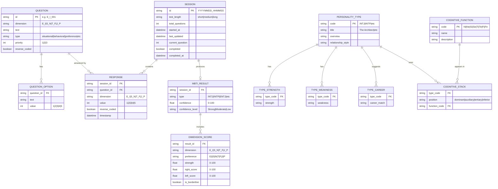

# MBTI Test Application - Data Models

## Data Constraints

### Business Rules
- **Questions per dimension**: Exactly 22 questions for each of the 4 dimensions (88 total)
- **Question priorities**: Each dimension must have at least 4 priority-1 questions for short test
- **Response values**: Must be integers 1-5 (5-point Likert scale)
- **Session completion**: A session is complete when all expected questions are answered
- **Type determination**: Requires responses from all 4 dimensions to calculate
- **Borderline threshold**: Dimension scores between 48-52% are considered borderline

### Unique Constraints
- `QUESTION.id` must be unique across all questions
- `SESSION.id` is timestamp-based, ensuring uniqueness
- `PERSONALITY_TYPE.code` limited to 16 valid MBTI types
- `COGNITIVE_FUNCTION.code` limited to 8 valid functions

### Required Relationships
- Every `RESPONSE` must reference a valid `QUESTION` and `SESSION`
- Every `MBTI_RESULT` requires a completed `SESSION`
- Every `PERSONALITY_TYPE` must have exactly 4 cognitive functions in stack
- Every `DIMENSION_SCORE` must belong to an `MBTI_RESULT`

## Data Types Notes

### Enum Values

**Dimensions (dimension field)**
- `E_I`: Extraversion vs Introversion
- `S_N`: Sensing vs Intuition  
- `T_F`: Thinking vs Feeling
- `J_P`: Judging vs Perceiving

**Test Lengths (test_length field)**
- `short`: 16 questions (4 per dimension)
- `medium`: 44 questions (11 per dimension)
- `long`: 88 questions (22 per dimension)

**Question Types (type field)**
- `situational`: Scenario-based questions
- `behavioral`: Past behavior questions
- `preference`: Direct preference questions
- `values`: Value-based questions
- `cognitive`: Thinking process questions
- Plus 10+ other types

**Cognitive Functions (function_code)**
- `Ni`: Introverted Intuition
- `Ne`: Extraverted Intuition
- `Si`: Introverted Sensing
- `Se`: Extraverted Sensing
- `Ti`: Introverted Thinking
- `Te`: Extraverted Thinking
- `Fi`: Introverted Feeling
- `Fe`: Extraverted Feeling

### Calculated Fields
- `DIMENSION_SCORE.strength`: Calculated as percentage dominance of preferred side
- `MBTI_RESULT.confidence`: Average of all dimension strengths
- `DIMENSION_SCORE.is_borderline`: True when strength is between 48-52%

## Data Flow Context

### Data Creation Flow
1. **Questions** are loaded from `questions.json` at startup (static data)
2. **Session** created when user starts test
3. **Responses** added as user answers each question
4. **MBTI_Result** calculated when all questions answered
5. **Dimension_Scores** computed from responses using scoring algorithm

### Data Consumption
- **TestEngine** reads Questions to present to user
- **Scorer** reads Responses to calculate Dimension_Scores
- **ResultAnalyzer** reads Personality_Types to enrich results
- **Reports** reads all result data for display
- **SessionManager** reads/writes Sessions for persistence

### Data Lifecycle
- **Sessions**: Created on test start, marked complete on finish, cleaned up after 7 days
- **Responses**: Persisted with session, can be updated if user goes back
- **Results**: Generated on test completion, exported to files
- **Static data** (Questions, Types, Functions): Loaded once at startup

### Storage Locations
- **Questions, Types, Functions**: JSON files in `/data` directory
- **Sessions**: JSON files in `~/.mbti_test/` or `%APPDATA%/mbti_test/`
- **Exported Results**: Text/JSON in `~/Documents/MBTI_Results/`

## Notes on Data Model

This is a hybrid model where:
- **Static reference data** (questions, personality types, cognitive functions) is stored in JSON files
- **User session data** (sessions, responses, results) is stored in JSON files per session
- **No traditional database** - uses file-based persistence for simplicity
- **Relationships** are managed through ID references in JSON structure
- **Data integrity** is enforced through validation in code rather than database constraints