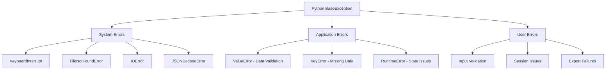
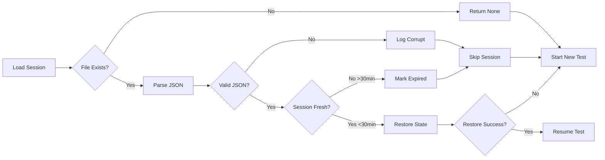
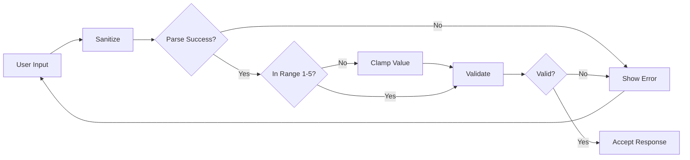
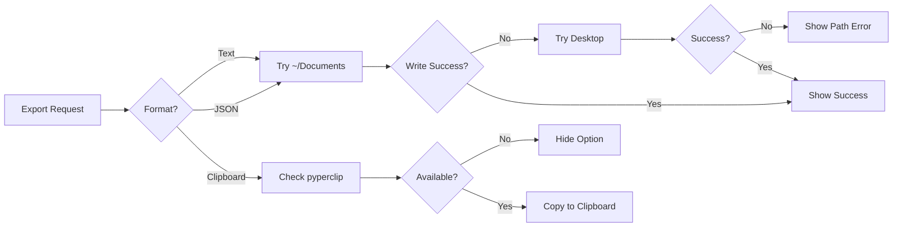

# MBTI Test Application - Error Handling Documentation

## Error Hierarchy



## Error Handling Layers

### 1. Input Validation Layer
**Location:** `core/validator.py`  
**Catches:** Invalid user responses, malformed input

```python
ValueError - Response Validation:
  - Terminal Display: "⚠️ Please select a valid option (1-5)"
  - Log Level: Not logged (expected user error)
  - Examples:
    - Non-integer response: "abc"
    - Out of range: 6, 0, -1
    - Float values: 3.5 (auto-rounded)
  - Recovery: Re-prompt user for valid input
  
ValueError - Response Parsing:
  - Terminal Display: "Cannot parse response"
  - Log Level: Not logged
  - Examples:
    - Unparseable string input
    - Invalid emoji selection
  - Recovery: Re-prompt with clearer instructions
```

### 2. Session Management Layer
**Location:** `core/session.py`  
**Catches:** Session persistence issues, data corruption

```python
FileNotFoundError:
  - Terminal Display: "Session not found"
  - Log Level: Not logged (normal flow)
  - Example: Attempting to resume non-existent session
  - Recovery: Return to main menu

JSONDecodeError:
  - Terminal Display: "❌ Session data corrupted"
  - Log Level: Not logged (handled gracefully)
  - Example: Malformed session JSON file
  - Recovery: Skip corrupted session, offer new test

IOError - Session Save:
  - Terminal Display: "Warning: Could not save progress"
  - Log Level: Not logged
  - Example: Disk full, permissions issue
  - Recovery: Continue test in memory, warn user

ValueError - No Active Session:
  - Terminal Display: None (internal)
  - Example: Trying to add response without session
  - Recovery: Create new session automatically
```

### 3. Data Loading Layer
**Location:** `utils/helpers.py`, `core/test_engine.py`  
**Catches:** Missing or invalid data files

```python
FileNotFoundError - Data Files:
  - Terminal Display: "❌ Required data files not found"
  - Log Level: Not logged
  - Example: Missing questions.json
  - Recovery: Exit application (cannot proceed)

JSONDecodeError - Data Files:
  - Terminal Display: "Data files corrupted"
  - Example: Malformed questions.json
  - Recovery: Exit application (cannot proceed)

KeyError - Missing Fields:
  - Terminal Display: "Invalid data structure"
  - Example: Question missing 'dimension' field
  - Recovery: Skip invalid item if possible
```

### 4. Export Layer
**Location:** `utils/exporter.py`  
**Catches:** File system and clipboard issues

```python
OSError - File Write:
  - Terminal Display: "❌ Failed to export results"
  - Log Level: Not logged
  - Example: No write permissions
  - Recovery: Try alternate location or skip

ImportError - Clipboard:
  - Terminal Display: None (feature hidden)
  - Example: pyperclip not installed
  - Recovery: Hide clipboard option from menu

Exception - General Export:
  - Terminal Display: "Export failed: [details]"
  - Example: Path too long, invalid characters
  - Recovery: Offer manual copy of results
```

## Error Response Formats

### Terminal Error Display
```python
# Error levels and their visual representation
ERROR_MESSAGES = {
    'file_not_found': "❌ Required data files not found",
    'invalid_response': "⚠️  Please select a valid option (1-5)",
    'session_corrupted': "❌ Session data corrupted",
    'export_failed': "❌ Failed to export results",
    'terminal_too_small': "⚠️  Terminal width must be at least 80 columns"
}

# Rich console formatting
console.print("[error]Error message here[/error]")  # Red text
console.print("[warning]Warning message[/warning]")  # Yellow text
console.print("[success]Success message[/success]")  # Green text
```

### User-Facing Error Messages
| Internal Error | User Message | Action Required |
|----------------|--------------|-----------------|
| `ValueError: Response must be integer` | "Please enter a number from 1 to 5" | Re-enter response |
| `FileNotFoundError: questions.json` | "Required data files not found" | Reinstall application |
| `JSONDecodeError in session` | "Session data corrupted" | Start new test |
| `KeyboardInterrupt` | "Test paused. Progress saved." | Can resume later |
| `IOError: Disk full` | "Could not save progress" | Free up disk space |
| `Terminal width < 80` | "Terminal too small" | Resize terminal |

## Global Error Handlers

### Application-Level Handler
**Location:** `main.py:78-80`  
**Catches:** Any unhandled exception

```python
Actions:
1. Display generic error message with details
2. Exit application gracefully
3. No logging (terminal app, no log infrastructure)
4. No crash reporting (offline application)
```

### Keyboard Interrupt Handler
**Location:** `main.py:76-77`  
**Catches:** Ctrl+C during test

```python
Actions:
1. Save current session state
2. Display pause message
3. Mark session as resumable
4. Exit cleanly
```

### Silent Error Suppression
**Location:** Various try/except blocks  
**Pattern:** Fail gracefully for non-critical operations

```python
Examples:
- Session cleanup failures (continue anyway)
- Optional dependency imports (disable feature)
- Clipboard operations (fall back to file)
```

## Error Recovery Flows

### Session Recovery Flow


### Response Validation Flow


### Export Failure Recovery


## Monitoring & Error Tracking

### Error Detection (No Formal Logging)
Since this is a terminal application without logging infrastructure:

| Error Type | Detection Method | User Notification |
|------------|------------------|-------------------|
| Critical (missing files) | Startup check | Exit with error message |
| Session errors | Try/except blocks | Warning but continue |
| User input errors | Validation functions | Immediate feedback |
| Export failures | Exception catching | Error with explanation |

### Manual Error Tracking
Users can identify issues through:
- Terminal error messages with ❌ or ⚠️ icons
- Failed operations shown in red text
- Explicit error descriptions in messages
- Session files for debugging if needed

## Error Prevention Strategies

### Input Sanitization
```python
# Prevents most ValueError exceptions
def sanitize_response(response):
    - Handles string numbers: "3" → 3
    - Rounds floats: 3.5 → 4
    - Clamps range: 7 → 5, -1 → 1
    - Extracts from emoji: "3️⃣" → 3
```

### Defensive File Operations
```python
# All file operations wrapped in try/except
- Session saves are atomic (write to temp, rename)
- Missing directories created automatically
- Corrupted files skipped, not fatal
- Read-only fallback for exports
```

### Graceful Degradation
| Missing Component | Fallback Behavior |
|-------------------|-------------------|
| plotext (charts) | ASCII bar charts |
| pyfiglet (ASCII art) | Plain text headers |
| pyperclip (clipboard) | File export only |
| Session directory | Use temp directory |
| Export directory | Use current directory |

## Common Error Scenarios

### Scenario 1: Mid-Test Interruption
**Trigger:** User presses Ctrl+C  
**Handling:**
1. KeyboardInterrupt caught
2. Current progress saved
3. "Test paused" message shown
4. Session marked resumable
5. Clean exit

### Scenario 2: Corrupted Session
**Trigger:** Malformed session JSON  
**Handling:**
1. JSONDecodeError caught
2. Session skipped from resume list
3. User informed if trying to resume
4. Option to start new test
5. No data loss for other sessions

### Scenario 3: Invalid Response Pattern
**Trigger:** All same answers (straight-lining)  
**Handling:**
1. Pattern detected at test completion
2. Warning displayed to user
3. Option to continue or restart
4. Results calculated if user continues
5. Pattern noted in results

### Scenario 4: Disk Full During Test
**Trigger:** IOError on session save  
**Handling:**
1. Save error caught silently
2. Test continues in memory
3. Warning shown to user
4. Results displayed normally
5. Export may fail (handled separately)

## Error Message Guidelines

### Severity Indicators
- ❌ **Critical**: Cannot continue operation
- ⚠️ **Warning**: Issue that needs attention
- ℹ️ **Info**: Helpful information
- ✅ **Success**: Operation completed

### Message Tone
- User-friendly, not technical
- Actionable when possible
- Brief and clear
- No stack traces shown

### Examples
- Good: "Please enter a number from 1 to 5"
- Bad: "ValueError: invalid literal for int()"
- Good: "Session data corrupted - starting fresh"
- Bad: "JSONDecodeError at line 1 column 45"