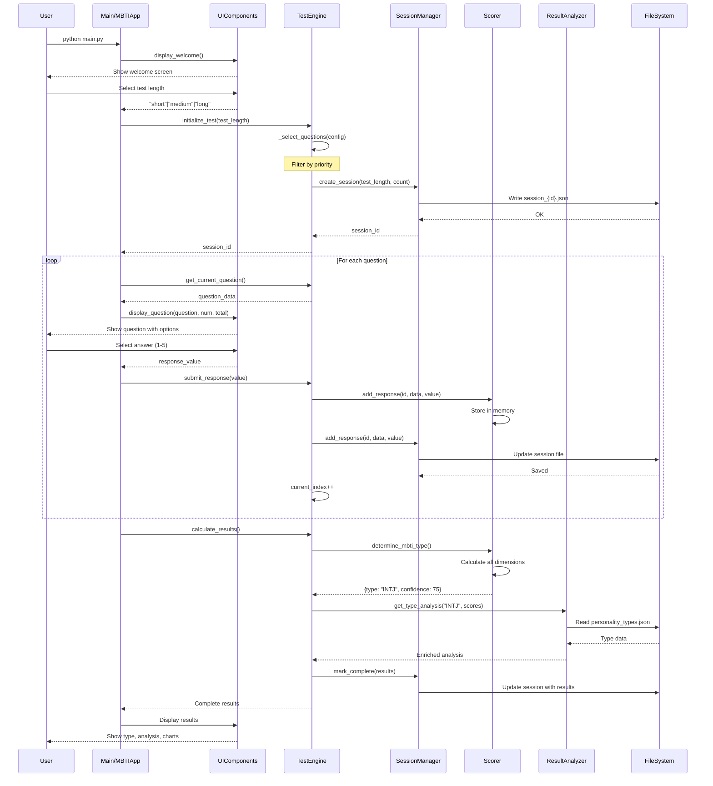
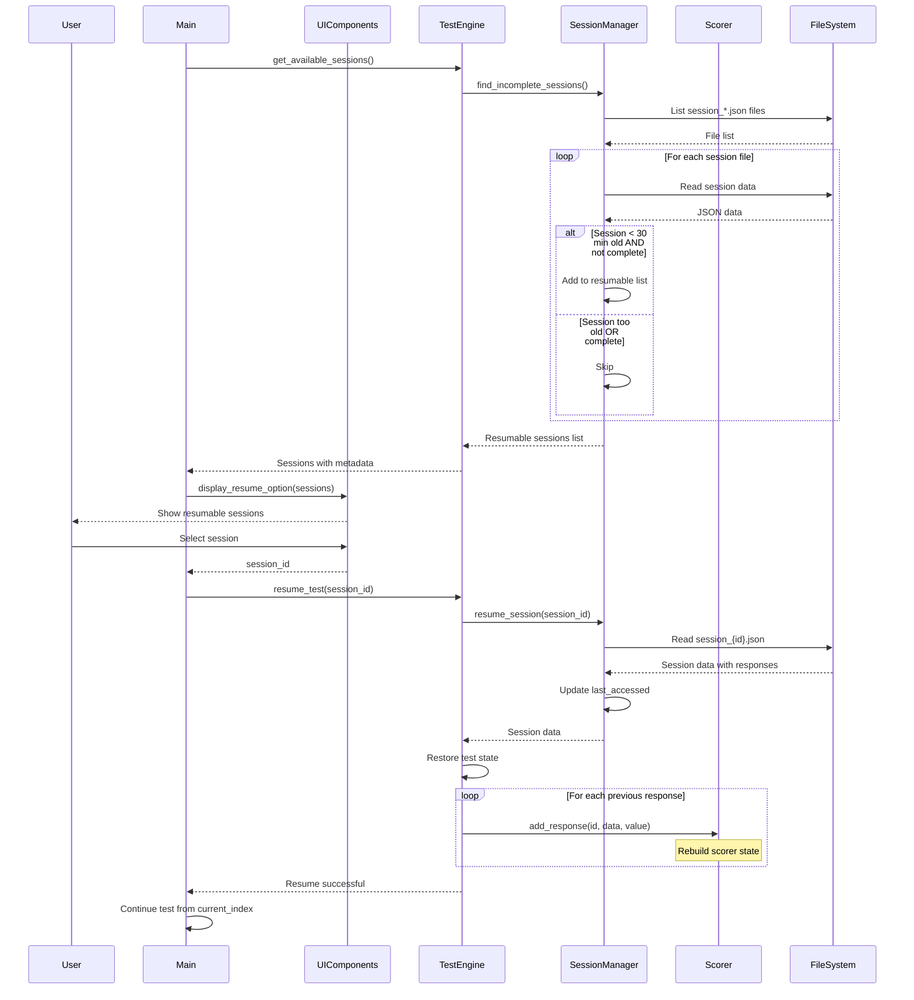
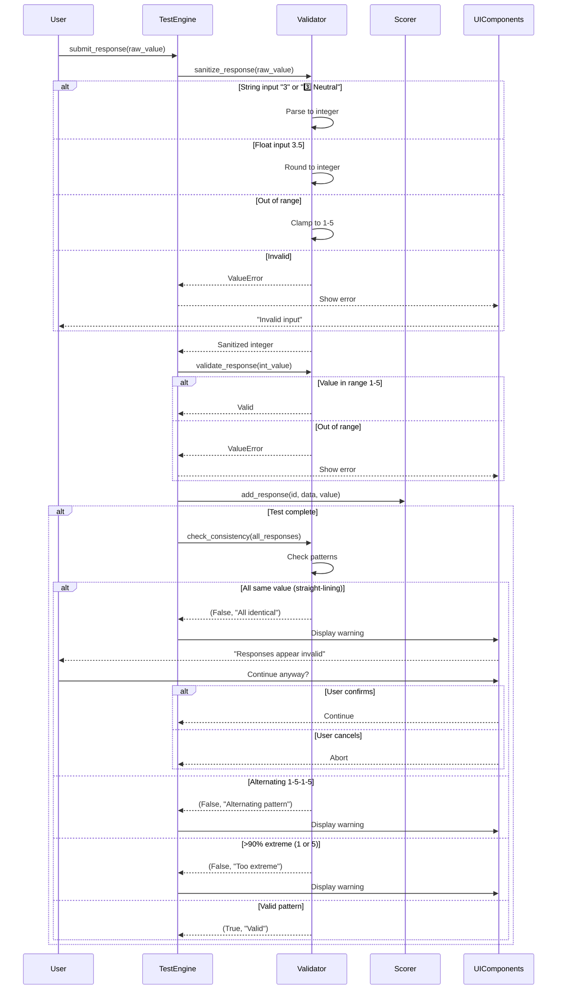
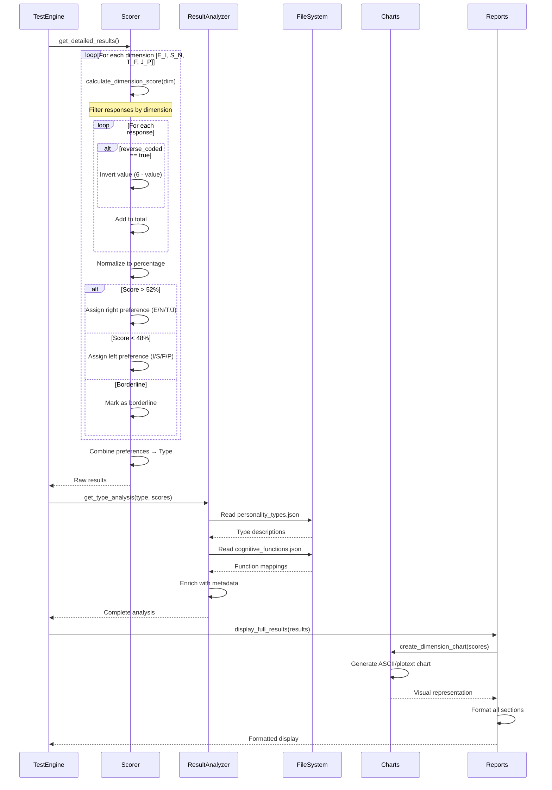
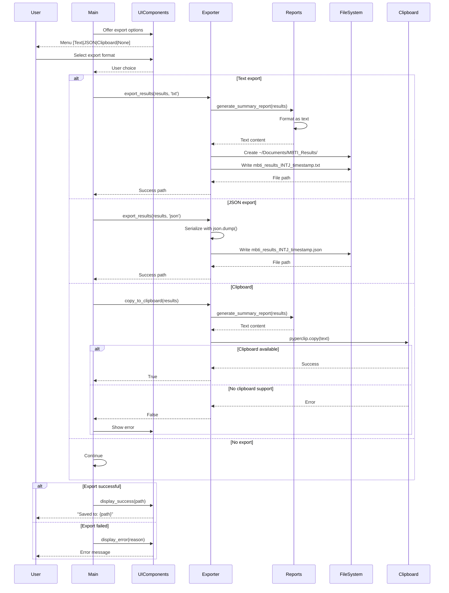

# MBTI Test Application - Sequence Diagrams

## 1. Complete Test Flow with Session Management
**Trigger:** User starts a new MBTI test
**Outcome:** Test completed, results calculated and displayed

### Performance Notes
- Question selection: <100ms (in-memory filtering)
- Per-question cycle: Limited by user response time
- Results calculation: <1 second
- Session saves: <50ms per write

### Failure Modes
- Session save failure: User warned but test continues
- Corrupt session: Cannot resume, must restart
- Missing data files: Application exits at startup

---

## 2. Resume Session Flow
**Trigger:** User chooses to resume a previous session
**Outcome:** Test continues from last answered question

### Performance Notes
- Session discovery: <100ms for typical directory
- Session restoration: <200ms including response replay
- State rebuild: O(n) where n = answered questions

### Failure Modes
- Session file deleted: Shows as not found
- Corrupted JSON: Session skipped, logged
- Version mismatch: Handled gracefully

---

## 3. Response Validation and Pattern Detection
**Trigger:** User submits responses during test
**Outcome:** Invalid patterns detected and warned

### Performance Notes
- Validation: <1ms per response
- Pattern detection: <10ms for 88 responses
- No async operations needed

### Failure Modes
- Invalid input: Re-prompt user
- Pattern detected: Warning but can continue
- Validation bypass: Not possible due to sanitization

---

## 4. Results Calculation and Enrichment
**Trigger:** All questions answered
**Outcome:** MBTI type determined and enriched with analysis

### Performance Notes
- Score calculation: O(n) where n = responses
- Type lookup: O(1) hash lookup
- Enrichment: <100ms for all data
- Chart generation: <500ms

### Failure Modes
- Missing type data: Show basic results only
- Chart library failure: Fall back to ASCII
- Calculation error: Log and show partial results

---

## 5. Export and Persistence Flow
**Trigger:** User chooses to export results
**Outcome:** Results saved to file system in chosen format

### Performance Notes
- Text generation: <100ms
- File write: <50ms for typical results
- Clipboard: Instant if supported

### Failure Modes
- Directory creation fails: Try alternate location
- File write fails: Show error, offer retry
- Clipboard unavailable: Hide option or show error

---

## Summary of Key Interactions

### Synchronous Operations
1. Question presentation → User response
2. Response validation → Score update
3. Results calculation → Type determination

### Asynchronous Patterns
- **Session auto-save**: Fire-and-forget after each response
- **No true async**: All operations are synchronous

### State Management
- **In-memory**: Current test state, responses, scores
- **Persisted**: Session files (JSON) after each response
- **Immutable**: Question data, personality types

### Critical Timing Constraints
1. Session timeout: 30 minutes for resume
2. Auto-save: Must complete before next question
3. No real-time requirements

### Transaction Boundaries
- Each response is atomic
- Results calculation is all-or-nothing
- Session updates are eventually consistent