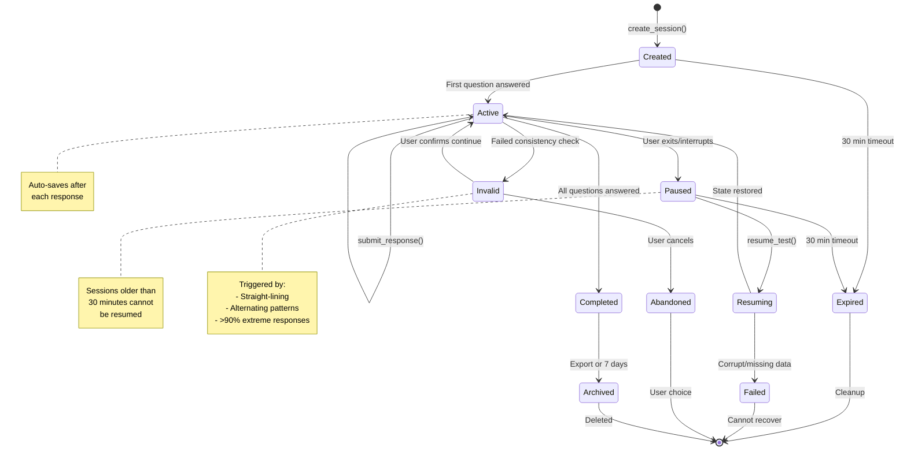
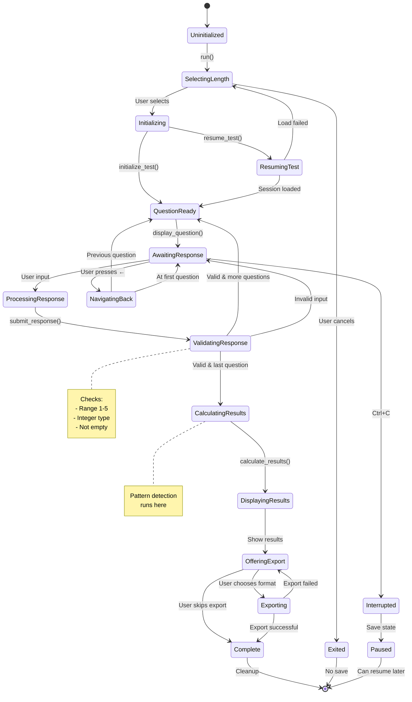
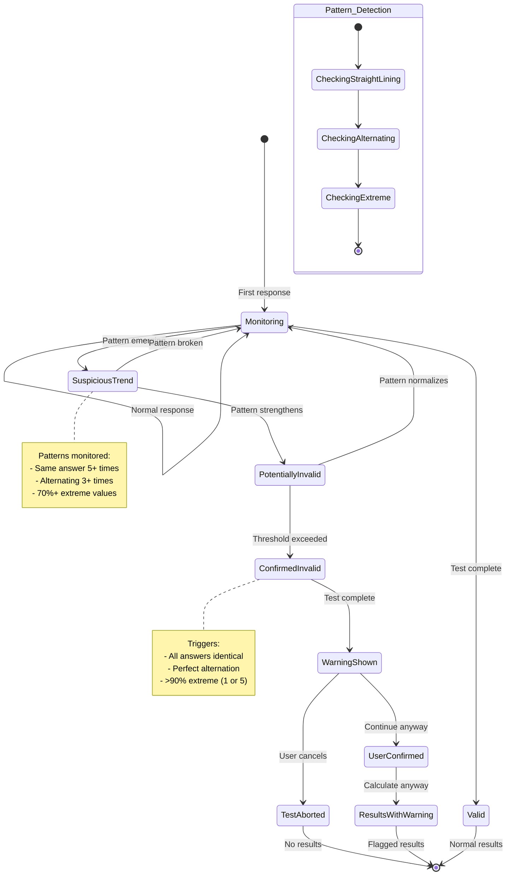

# MBTI Test Application - State Machine Diagrams

## Test Session State Machine
**Context:** Controls the lifecycle of a test session from creation to completion
**State Storage:** Persisted in JSON files at `~/.mbti_test/session_{id}.json`

### States
- **Created**: Session initialized but no responses yet
- **Active**: User is actively answering questions
- **Paused**: Session saved but user has exited
- **Resuming**: Session being restored from disk
- **Completed**: All questions answered, results calculated
- **Invalid**: Response pattern detected as potentially invalid
- **Expired**: Session too old to resume (>30 minutes)
- **Failed**: Session data corrupted or unreadable
- **Abandoned**: User chose not to continue after warning
- **Archived**: Completed session after export or timeout

### Transition Guards
- `create_session()`: Valid test length (short/medium/long)
- `submit_response()`: Response value in range 1-5
- `resume_test()`: Session exists and <30 minutes old
- `User confirms continue`: Explicit confirmation after warning
- `All questions answered`: current_index >= total_questions
- `30 min timeout`: last_updated > 30 minutes ago

### Transition Actions
- `Created → Active`: Initialize scorer, save first response
- `Active → Active`: Update scorer, auto-save to disk, increment index
- `Active → Paused`: Save current state, preserve timestamp
- `Paused → Resuming`: Load from disk, rebuild scorer state
- `Active → Completed`: Calculate results, generate analysis, mark complete
- `Active → Invalid`: Display warning, prompt for confirmation
- `Completed → Archived`: Export results, clean up session file
- `* → Expired`: Delete session file from disk

---

## Test Engine State Machine
**Context:** Controls the flow of question presentation and test progression
**State Storage:** In-memory during test execution, synced with SessionManager

### States
- **Uninitialized**: Application started, no test selected
- **SelectingLength**: Showing test length menu
- **Initializing**: Loading questions, creating session
- **ResumingTest**: Attempting to restore previous session
- **QuestionReady**: Question loaded, ready to display
- **AwaitingResponse**: Question displayed, waiting for input
- **ProcessingResponse**: Response received, being processed
- **ValidatingResponse**: Checking response validity
- **NavigatingBack**: User navigating to previous question
- **CalculatingResults**: Computing MBTI type from all responses
- **DisplayingResults**: Showing personality analysis
- **OfferingExport**: Presenting export options
- **Exporting**: Writing results to file/clipboard
- **Interrupted**: User pressed Ctrl+C
- **Paused**: State saved, can resume
- **Complete**: Test finished successfully
- **Exited**: User quit without saving

### Transition Guards
- `User selects`: Valid selection (short/medium/long)
- `Valid & more questions`: current_index < total_questions
- `Valid & last question`: current_index == total_questions - 1
- `Invalid input`: Value not integer 1-5
- `Previous question`: current_index > 0
- `At first question`: current_index == 0
- `User chooses format`: txt/json/clipboard selected

### Transition Actions
- `SelectingLength → Initializing`: Load questions by priority
- `Initializing → QuestionReady`: Create session, reset scorer
- `ResumingTest → QuestionReady`: Restore responses to scorer
- `ProcessingResponse → ValidatingResponse`: Validate and sanitize input
- `ValidatingResponse → QuestionReady`: Save response, increment index
- `ValidatingResponse → CalculatingResults`: Check response patterns
- `CalculatingResults → DisplayingResults`: Enrich with type analysis
- `Exporting → Complete`: Create file, update session
- `Interrupted → Paused`: Auto-save current state

---

## Response Pattern Validation State Machine
**Context:** Monitors response patterns to detect potentially invalid test-taking behavior
**State Storage:** In-memory during test, results stored in session

### States
- **Monitoring**: Normal response collection
- **SuspiciousTrend**: Early pattern detected but not conclusive
- **PotentiallyInvalid**: Strong pattern detected, monitoring closely
- **ConfirmedInvalid**: Pattern exceeds threshold for validity concern
- **WarningShown**: User notified of potential issue
- **UserConfirmed**: User acknowledges and continues
- **TestAborted**: User chooses to restart/quit
- **ResultsWithWarning**: Results calculated but flagged
- **Valid**: No concerning patterns detected

### Pattern Detection Sub-states
- **CheckingStraightLining**: All responses have same value
- **CheckingAlternating**: Responses alternate (1-5-1-5 or similar)
- **CheckingExtreme**: Most responses are 1 or 5

### Transition Guards
- `Pattern emerging`: 5+ consecutive same answers OR 3+ alternations
- `Pattern strengthens`: Continues for 10+ responses
- `Threshold exceeded`: Meets invalid criteria
- `Pattern normalizes`: Mixed responses for 5+ questions
- `Pattern broken`: Different response breaks sequence

### Transition Actions
- `Monitoring → SuspiciousTrend`: Start tracking pattern
- `PotentiallyInvalid → ConfirmedInvalid`: Set validation flag
- `ConfirmedInvalid → WarningShown`: Display warning dialog
- `UserConfirmed → ResultsWithWarning`: Add warning to results
- `WarningShown → TestAborted`: Clear session, return to menu

### Pattern Thresholds
- **Straight-lining**: 100% identical responses
- **Alternating**: Perfect 1-5-1-5 pattern for >50% of test
- **Extreme bias**: >90% responses are 1 or 5
- **Mixed healthy**: At least 3 different values used, <70% any single value

---

## Summary of State Management

### Critical State Transitions
1. **Session Creation → Active**: Must create file atomically
2. **Active → Paused**: Must save all responses before exit
3. **Paused → Active**: Must validate session age and integrity
4. **Active → Completed**: Must run pattern validation before results

### State Persistence Strategy
- **Session states**: Persisted to JSON after every transition
- **Test engine states**: Ephemeral, rebuilt from session
- **Validation states**: Calculated on-demand, not persisted

### Concurrency & Recovery
- **No concurrent sessions**: Single active session per user
- **Atomic saves**: Write to temp file, then rename
- **Recovery mechanism**: Resume from last saved response
- **Cleanup**: Sessions >7 days auto-deleted on startup

### Business Rules Encoded
1. Sessions expire after 30 minutes of inactivity
2. Pattern validation runs only on test completion
3. Invalid patterns trigger warnings but don't block completion
4. Export is optional but offered to all completed tests
5. Navigation limited to answered questions only